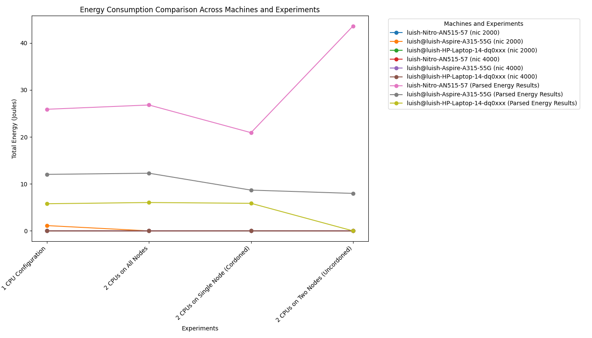

# Research Project: Energy Consumption ⚡️🖥️  


This repo is a **lab playground** for energy consumption experiments across multiple distributed systems and benchmarks.  
Think of it as a **zoo of workloads + tools** wired up to measure CPU, RAM, and power usage with **Ecofloc** (our main energy profiler).


## Repo Map 🗺️  

```

Research-Project-Energy-Consumption/
│
├── ecofloc/             # Ecofloc profiler (energy measurements)
├── DeathStarBench/      # Social network microservices benchmark
├── mubench/             # Benchmarking framework (reference project)
├── teastore/            # Java EE microservice benchmark (TeaStore)
├── scheduler-plugins/   # Kubernetes scheduler extensions
└── README.md            # This file

````

Each subproject comes with its own quirks (and usually its own README).  
Some benchmarks are CPU/memory intensive, others are I/O heavy.  
Ecofloc lets us **track actual energy per container**, which is the whole point of this playground.  

---

## Setup 🔧  

### Prerequisites  

- Docker + Docker Compose  
- Kubernetes 
- Python ≥ 3.10 (for Ecofloc tools)  
- A machine with RAPL or similar energy counters 
- Ecofloc Requirements
- SSH
- WRK2
- go
  

### Install Ecofloc  

Go here and install on every machine:
https://github.com/Luis-Huachaca-HV/ecofloc-microservices/tree/energy-experiments

### Install Each Benchmark

You Have TeaStore, DB Benchmarnk and MuBench, install them, and deploy them in the nodes you prefer, in this 
case we had 3 nodes and the examples are for 3 nodes, but any amount of nodes can be put.


Go here and install on every machine:
https://github.com/Luis-Huachaca-HV/ecofloc-microservices/tree/energy-experiments

### Gather Results.

In this case we have graphics in TeaStore and DBench, first of all after you ran the overloaders and measured the energy in each component of the computer, the .sh (deploycomp.sh and energy_experiment.sh), logs of energy consumption will be generated, you can use the scripts in python to plot the variables.





The objective of the research is to identify key variables on energy consumption using diferent periferals of 
the machine, thus we can correlate directly the computational implementations to energy consumption, this for Green Computing purposes. 

---


## References 📚

* [Ecofloc](https://github.com/bsc-dom/eco-floc) – Energy profiler.
* [DeathStarBench](https://github.com/delimitrou/DeathStarBench) – Social network microservices benchmark.
* [mubench](https://github.com/mubench/mubench) – Generic benchmarking project.
* [TeaStore](https://github.com/DescartesResearch/TeaStore) – Microservice demo app.

---

