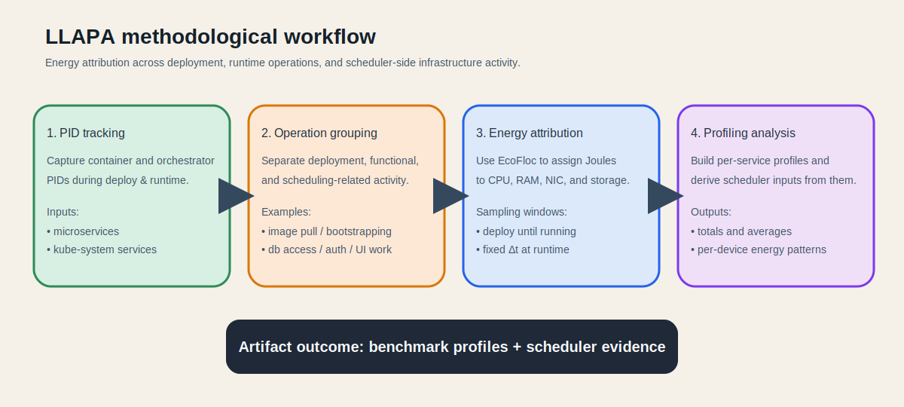
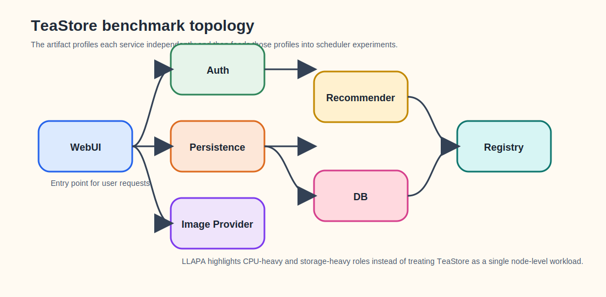
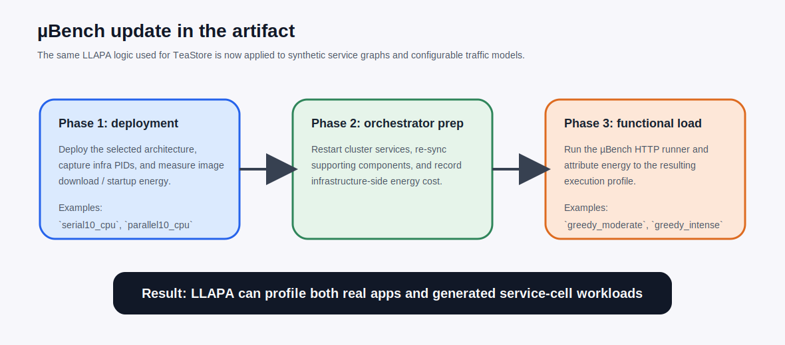

# LLAPA Artifact: Multi-Device Energy Profiling for Microservice Applications

This repository is the artifact companion for the LLAPA methodology described in the paper _“LLAPA: A Multi-Device Methodological Strategy for Energy Profiling in Microservice-Based Applications.”_ It packages the experiment assets, benchmark notes, scheduler plugin code, and figures used to study how CPU, RAM, network, and storage energy vary across microservices and orchestration decisions.

## What this artifact contains

- `benchmarks/teastore/`: TeaStore benchmark material, local plots, and benchmark-specific notes.
- `benchmarks/mubench/`: µBench artifact page plus imported LLAPA plots from the updated µBench campaign.
- `scheduler-plugins/`: the `EnergyScore` Kubernetes scheduler plugin, configuration patches, and scheduler evolution notes.
- `ecofloc/`: EcoFloc component probes and configuration files used for per-device energy attribution.
- `scaphandre/`: additional energy tooling kept for comparison and auxiliary experiments.

## LLAPA in one page

LLAPA is a profiling workflow, not just a plotting script. The artifact follows the same four steps as the paper:

1. Track the PIDs of microservices and relevant orchestrator services.
2. Group the observed activity into deployment, functional, and scheduling-related operations.
3. Attribute energy to CPU, RAM, NIC, and storage with EcoFloc.
4. Build per-service energy profiles that can later guide scheduling decisions.

The main contribution is the move away from coarse node-level or CPU-only views. The artifact keeps energy tied to the service that caused it and to the device where it was spent.

## Benchmarks covered

### TeaStore

TeaStore is the benchmark used in the paper to validate LLAPA on a real microservice application with heterogeneous roles such as UI handling, authentication, persistence, image delivery, and database access.

The core paper finding is preserved here: energy is not uniformly distributed across services. `teastore-webui` and `teastore-persistence` were the dominant consumers, CPU was not the only relevant device, and storage-heavy behavior was visible in `teastore-image`. The local TeaStore folder also contains older scheduler-comparison plots that contrast plugin and non-plugin runs under standby and overload conditions.

See [benchmarks/teastore/README.md](/home/luish/Documents/repoluispro/Research-Project-Energy-Consumption/benchmarks/teastore/README.md).

### µBench

After the paper, LLAPA was extended to profile µBench as well. This matters because µBench lets you vary both the service-graph architecture and the workload model, which makes it useful for checking whether LLAPA still separates deployment, orchestration, and functional energy when the application is synthetic instead of hand-crafted.

The imported µBench figures show the same structure as TeaStore, but across generated topologies and runner-driven workloads. In the currently archived campaign data:

- phase 3 dominates total energy by a wide margin;
- RAM is the largest contributor in the captured `serial10_cpu` runs;
- different load shapes change total energy mostly through execution duration, not just request count.

See [benchmarks/mubench/README.md](/home/luish/Documents/repoluispro/Research-Project-Energy-Consumption/benchmarks/mubench/README.md).

## Scheduler evolution

The scheduler part of the artifact captures two stages of the LLAPA-driven scheduling story.

### Version 1

`v1` is the implementation currently stored in this repository. It adds an `EnergyScore` plugin to `scheduler-plugins` and biases placement using a single energy label per node:

- node label: `energy-score`
- scheduler profile: `energy-scheduler`
- config hook: `weightMultiplier`

This version is useful because it proves end-to-end scheduler integration: plugin registration, scheduler configuration, and pod scheduling with a custom profile.

### Version 2

`v2` is the next step documented in the external scheduler notes that informed this artifact refresh. It keeps the same Kubernetes integration point, but replaces the single-label view with a multi-device score:

- `energy.cpu.j`
- `energy.ram.j`
- `energy.nic.j`
- `energy.sd.j`

The intended improvement is straightforward: align scheduler inputs with LLAPA outputs. Instead of treating a node as “energetically good” in the abstract, `v2` can prefer nodes whose device-level energy characteristics match the incoming microservice’s profile.

For detailed performance, throughput, and energy consumption improvements of Version 2 compared to Version 1, see the **[V2 vs V1 Evaluation & Comparison Report](scheduler-plugins/COMPARISON.md)**.

See [scheduler-plugins/README.md](/home/luish/Documents/repoluispro/Research-Project-Energy-Consumption/scheduler-plugins/README.md).

## Reproducibility notes

This repository is the curated artifact layer. Some execution scripts and historical experiment folders still live in the original working directories used during the campaigns:

- TeaStore campaign context: `/home/luish/Documents/death/teastore/TeaStore/examples/httploadgenerator`
- µBench campaign context: `/home/luish/Documents/death/muBench`
- scheduler iteration notes: `/home/luish/Documents/death/scheduler-plugins`

The benchmark READMEs point back to the canonical scripts used there, especially `run_workload.sh`, `measure_energy.sh`, `run_llapa_repetitions.sh`, and `measure_energy_mubench.sh`.

## Quick navigation

- Paper-aligned TeaStore artifact: [benchmarks/teastore/README.md](/home/luish/Documents/repoluispro/Research-Project-Energy-Consumption/benchmarks/teastore/README.md)
- Updated µBench artifact: [benchmarks/mubench/README.md](/home/luish/Documents/repoluispro/Research-Project-Energy-Consumption/benchmarks/mubench/README.md)
- Scheduler plugin artifact: [scheduler-plugins/README.md](/home/luish/Documents/repoluispro/Research-Project-Energy-Consumption/scheduler-plugins/README.md)
- **[Scheduler V2 vs V1 Evaluation Report](scheduler-plugins/COMPARISON.md)**
