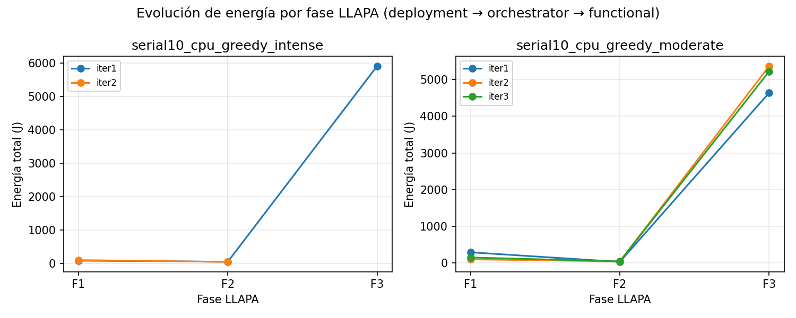
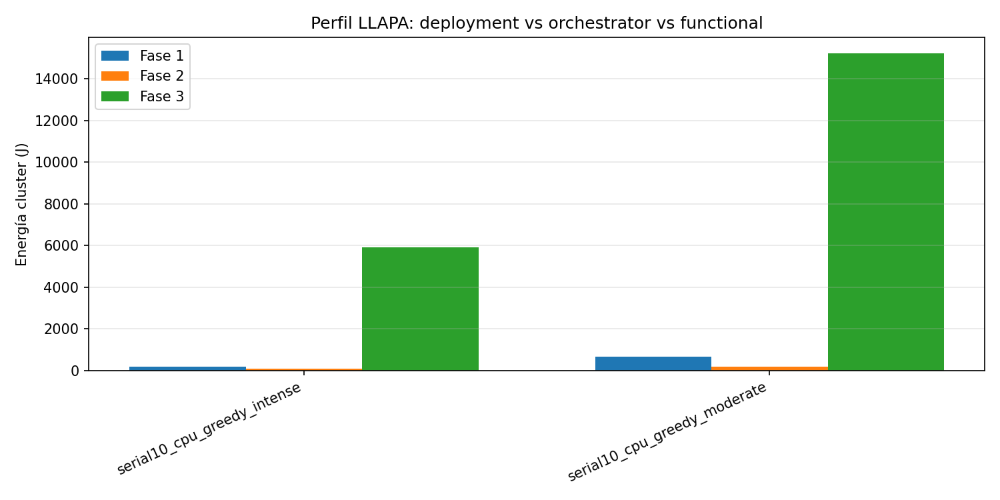
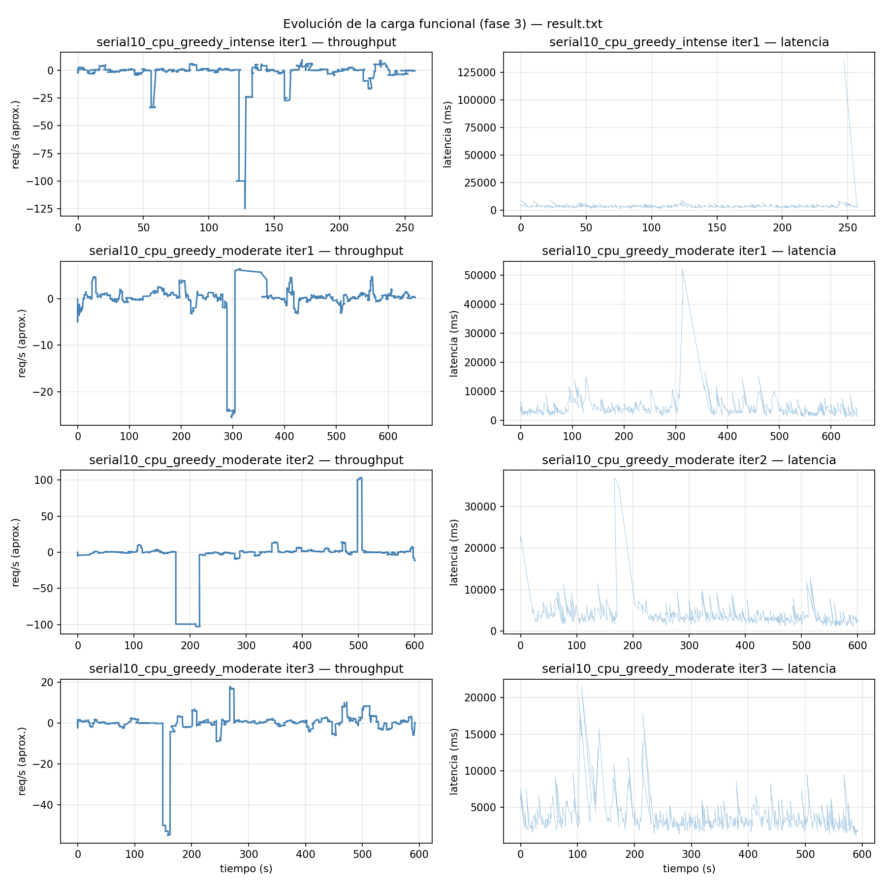
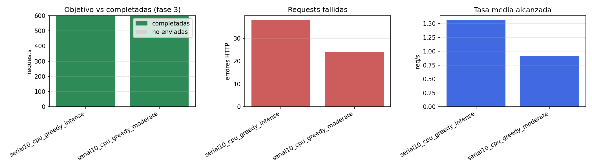
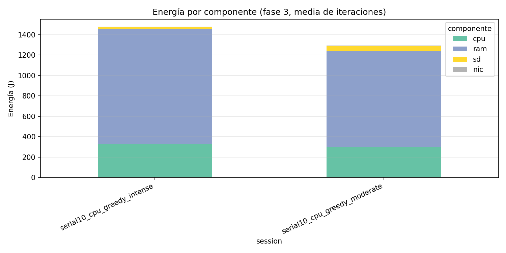
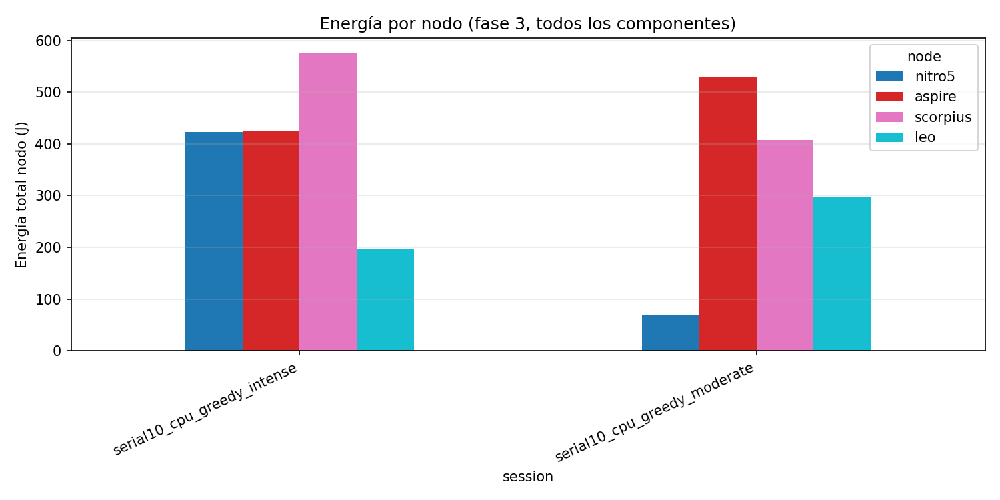
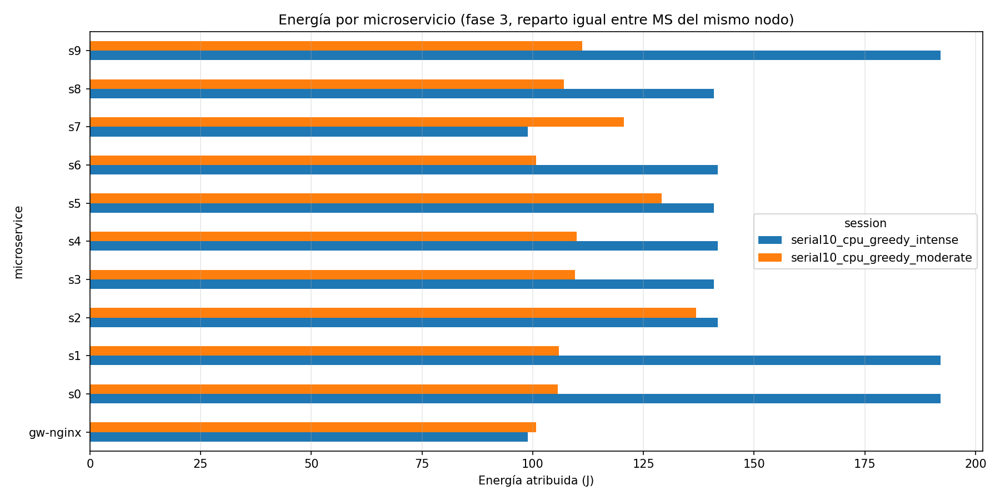
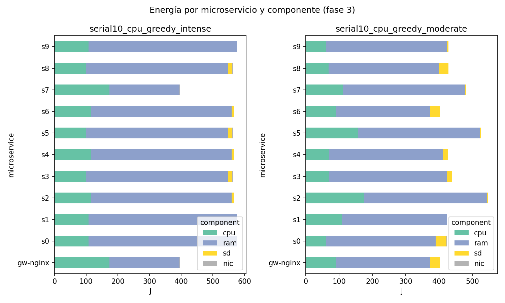

# µBench in LLAPA

This folder captures the post-paper extension of LLAPA to µBench. Unlike TeaStore, µBench is a configurable service-cell benchmark, so it lets the methodology exercise different service graphs and traffic patterns without changing the measurement pipeline.

## What changed after the paper

The paper validated LLAPA with TeaStore. After that, the same workflow was applied to µBench to check whether LLAPA still works when:

- the service topology is generated rather than fixed;
- the workload model can switch between greedy and periodic modes;
- deployment, orchestrator preparation, and runtime execution are clearly separated into scripted phases.

This update is important because it moves LLAPA from one benchmarked application to a more general microservice workload generator.

## Imported figures

The figures below were imported from the µBench campaign workspace at `/home/luish/Documents/death/muBench/analysis/plots`.

### Phase-level behavior

The captured sessions show the same broad pattern as the paper: the functional phase dominates total energy. In the archived `serial10_cpu` runs, phase 3 accounts for `5911.76 J` in `greedy_intense` and `15228.72 J` in `greedy_moderate`, far above phases 1 and 2.

### Functional load and saturation

The runner summaries indicate that the current archived sessions were not saturation-driven failures. The available `saturation_detail.csv` marks both captured loads as `False` for saturation, which helps interpret higher energy mainly as longer execution time rather than collapse under backlog.

### Device and node distribution

In the imported dataset, RAM dominates phase 3 energy for the archived `serial10_cpu` sessions:

- `greedy_intense`: RAM `4525.00 J`, CPU `1314.31 J`, storage `60.82 J`, NIC `11.63 J`
- `greedy_moderate`: RAM `11337.31 J`, CPU `3273.77 J`, storage `594.21 J`, NIC `23.43 J`

That is exactly the kind of result LLAPA is meant to preserve: the energy-heavy device is workload-dependent and is not always CPU.

### Per-microservice views

These plots are the µBench counterpart to the TeaStore service-level profiles. They provide the input needed for future scheduler iterations where placement decisions depend on which device a service stresses most.

## Canonical campaign scripts

The full campaign was executed from the original µBench workspace:

`/home/luish/Documents/death/muBench`

The main scripts there were:

- `run_llapa_repetitions.sh`
- `run_workload_mubench.sh`
- `measure_energy_mubench.sh`
- `run_fase3_only_mubench.sh`

There is also a detailed execution note at:

`/home/luish/Documents/death/muBench/Docs/LLAPA_mubench_ejecucion.md`

## Current interpretation

- LLAPA is no longer tied only to TeaStore.
- The methodology transfers cleanly to a synthetic benchmark with explicit phase boundaries.
- The available µBench evidence reinforces the paper’s argument that multi-device attribution matters, because RAM dominates the archived runtime sessions and NIC remains comparatively small.
