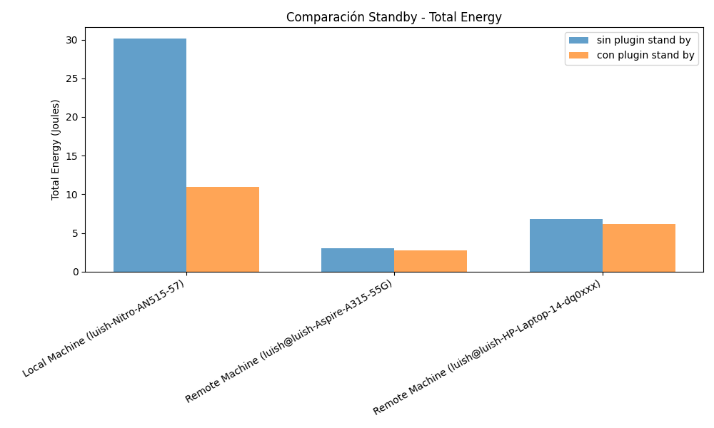
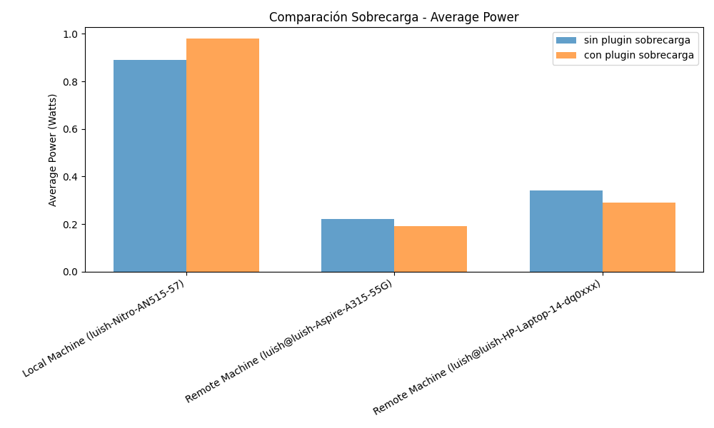
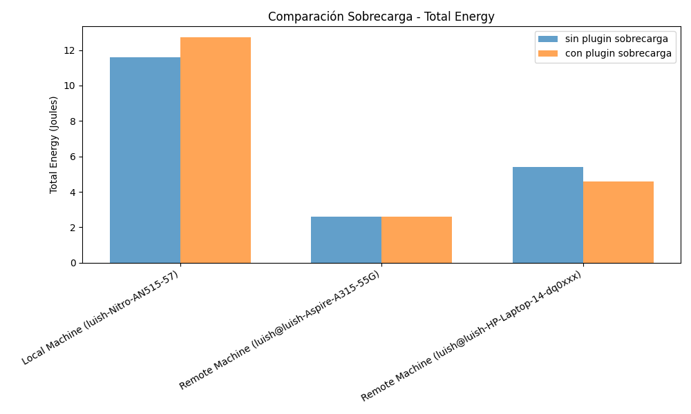

# TeaStore in LLAPA

This folder documents the TeaStore side of the LLAPA artifact. TeaStore is the benchmark used in the paper to validate multi-device energy profiling on a real microservice application deployed on Kubernetes.

## Why TeaStore matters here

TeaStore exposes heterogeneous service roles:

- `webui` concentrates user-facing request handling.
- `auth` captures session and authentication logic.
- `persistence` and `db` represent data-heavy paths.
- `image-provider` introduces storage-oriented behavior.
- `registry` and `recommender` keep the service graph realistic without dominating energy.

That mix is what makes TeaStore a good LLAPA target: the application is small enough to understand, but rich enough to show that energy depends on the role of each microservice and not only on total cluster load.

## Main findings preserved from the paper

- `teastore-webui` and `teastore-persistence` were the most energy-demanding microservices overall.
- CPU was the largest component for the dominant services, but storage became relevant for `teastore-image`.
- `teastore-registry` and `teastore-recommender` remained the least energy-intensive services.
- The result justifies using service-level profiles as scheduler inputs instead of relying only on node-level averages.

## Available local files

- `energy_experimet.sh`: local helper used to launch an energy experiment.
- `gepids.sh`: PID extraction helper for LLAPA-style attribution.
- `energy_results_teastore.csv`: archived text output with plugin and non-plugin energy measurements.
- `examples/httploadgenerator/limbo_results_teastore.csv`: load-generator output used to align performance with energy.
- `standby_average_power.png`
- `standby_total_energy.png`
- `sobrecarga_average_power.png`
- `sobrecarga_total_energy.png`

## Legacy scheduler comparison in this folder

These four plots are not the paper’s per-microservice figure. They are the local comparison between runs with and without the scheduler plugin under standby and overload conditions.

### Standby

From the archived values in [energy_results_teastore.csv](/home/luish/Documents/repoluispro/Research-Project-Energy-Consumption/benchmarks/teastore/energy_results_teastore.csv), the plugin run reduced the local-node standby energy from `30.13 J` to `10.93 J`, while the remote nodes changed only slightly. This is useful as a first scheduler-side sanity check, but it should be read as a small comparative experiment, not as the full LLAPA validation.

### Overload

Under the archived overload run, the plugin case shifted energy differently across nodes: the local node increased slightly from `11.61 J` to `12.72 J`, while one remote node dropped from `5.39 J` to `4.57 J`. The point is not that the plugin always lowers every node’s energy independently; the point is that scheduling changes the distribution of where energy is spent.

## How this maps to the paper workflow

TeaStore follows the same LLAPA stages described in the paper:

1. Deployment and PID capture.
2. Operation grouping for deployment and runtime actions.
3. EcoFloc sampling across CPU, RAM, NIC, and storage.
4. Profile construction for each microservice.

The canonical TeaStore campaign directory used during the experiments is:

`/home/luish/Documents/death/teastore/TeaStore/examples/httploadgenerator`

The core scripts referenced from the working campaign were:

- `run_workload.sh`
- `measure_energy.sh`

Those remain the source of truth for the larger historical TeaStore runs mentioned in the paper.
