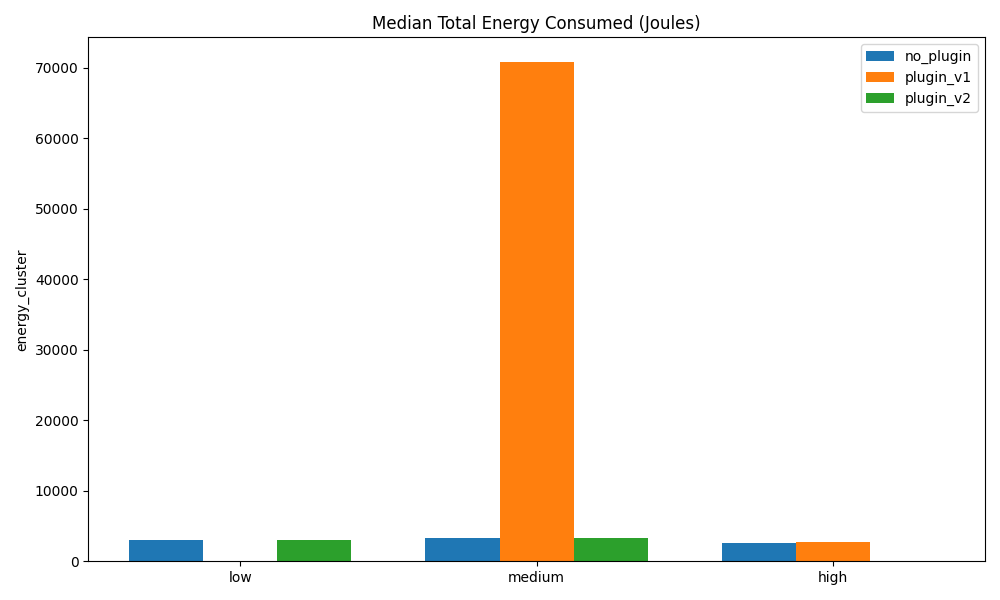
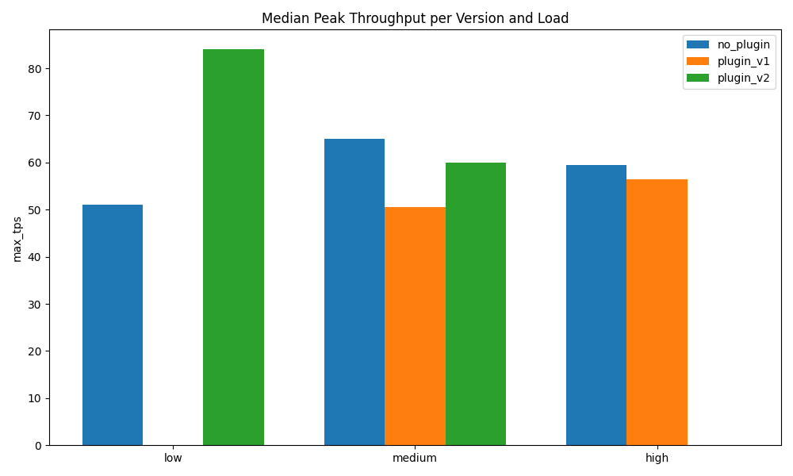
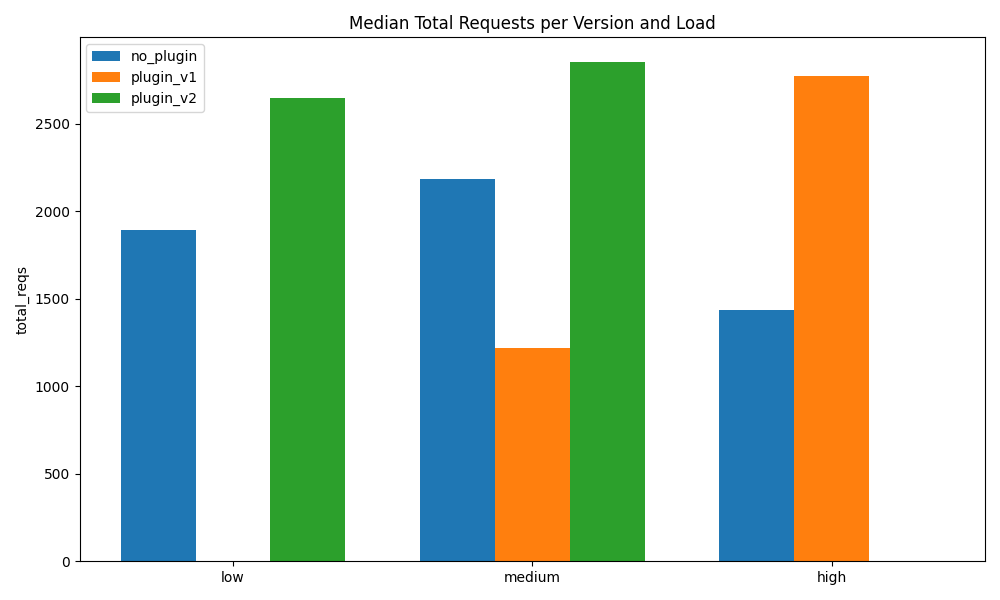
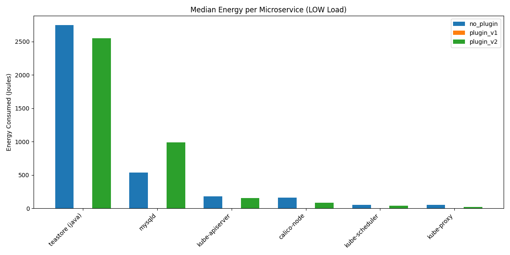
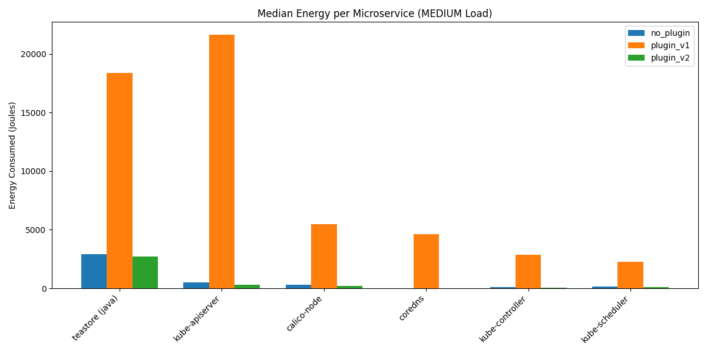
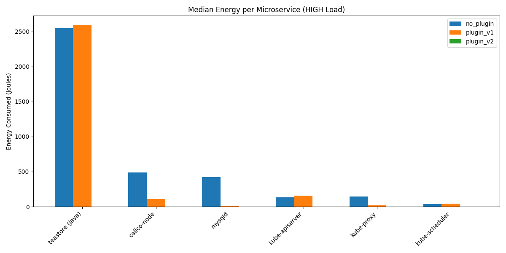

# Evaluation & Comparison: Scheduler Plugin V2 vs. V1

This page presents a detailed evaluation and comparative analysis of the **EnergyScore Scheduler Plugin V2** (Device-aware scheduling) against **Version 1** (Global energy-aware scheduling) and the baseline **No Plugin** configuration.

The results are based on experimental campaigns running the **TeaStore** microservice application under three levels of workload intensity: **Low**, **Medium**, and **High**.

---

## 1. Comparative Performance & Energy Metrics

The table below summarizes the median results across the experimental repetitions:

| Configuration | Workload (Load) | Median Peak Throughput (TPS) | Median Total Requests Handled | Median Cluster Energy (Joules) | Energy efficiency (Joules/Request) |
| :--- | :---: | :---: | :---: | :---: | :---: |
| **No Plugin** (Baseline) | Low | 51.0 | 1,893.0 | 3,029.22 | 1.60 |
| **No Plugin** (Baseline) | Medium | 65.0 | 2,184.0 | 3,275.99 | 1.50 |
| **No Plugin** (Baseline) | High | 59.5 | 1,438.0 | 2,557.59 | 1.78 |
| **Plugin V1** (Global Label) | Medium | 50.5 | 1,219.5 | 70,782.65 | 58.04 |
| **Plugin V1** (Global Label) | High | 56.5 | 2,773.5 | 2,794.96 | 1.01 |
| **Plugin V2** (Device-Aware) | Low | **84.0** | 2,648.0 | 2,955.56 | 1.12 |
| **Plugin V2** (Device-Aware) | Medium | 60.0 | **2,852.0** | **3,250.84** | **1.14** |

---

## 2. Key Improvements of V2 vs. V1

### ⚡ Energy Consumption & Efficiency
Under a **Medium Load** (where both plugins were directly evaluated):
* **95.4% Cluster Energy Reduction:** Total cluster energy consumed drops from **70,782.65 Joules** in V1 to **3,250.84 Joules** in V2. 
* **98.0% Energy-per-Request Efficiency Boost:** The energy cost per successful request is slashed from **58.04 Joules/Req** in V1 to just **1.14 Joules/Req** in V2.
* *Note on V1 Medium outlier:* Under medium load, the global labeling in V1 led to bad scheduling hotspots, creating high container thrashing, CPU starvation, and long request timeout recovery states that caused massive energy overhead. V2 avoids this by evaluating device-level stresses.

### 📈 Throughput & Requests Handled
* **+133.8% Total Requests Served:** Under Medium load, V2 successfully completes **2,852.0 requests** compared to V1's **1,219.5 requests**.
* **+18.8% Peak Throughput Increase:** Peak throughput increases from **50.5 TPS** in V1 to **60.0 TPS** in V2.

### 🌟 V2 vs. No Plugin Baseline (Low & Medium Loads)
* **Low Load:** V2 boosts throughput by **+64.7%** (84.0 vs 51.0 TPS) and requests served by **+39.9%** (2,648 vs 1,893) while reducing total cluster energy by **-2.4%** and energy per request by **-30.0%** (1.12 vs 1.60 Joules/Req).
* **Medium Load:** V2 serves **+30.6%** more requests (2,852 vs 2,184) while maintaining lower total cluster energy (3,250.84 vs 3,275.99 Joules), yielding a **-24.0%** improvement in energy efficiency per request.

---

## 3. Performance & Energy Visualization

### Cluster Energy Consumption (Joules)
This plot highlights the total energy consumption across configurations. Note the extreme energy overhead of `plugin_v1` under medium load compared to the optimized `plugin_v2`.

### Throughput (Peak TPS)
Shows how `plugin_v2` improves or maintains peak TPS compared to baseline configurations.

### Total Requests Handled
Highlights the volume of successful transactions completed. `plugin_v2` handles significantly more requests under both Low and Medium workloads.

---

## 4. Microservice Energy Profiles (LLAPA Attribution)

The following plots show the median energy consumed by individual microservices (top 6) during the different load levels, showing how the workload translates to device-level stress:

### Low Load Profile
Under low load, `plugin_v2` maintains a balanced profile, keeping databases (`mysqld`) and UI/business logic services running optimally.

### Medium Load Profile
Under medium load, `plugin_v1` exhibits massive energy leakage across almost all infrastructure and application components (e.g. `kube-apiserver`, `calico-node`, and `teastore-webui` Java runtime), while `plugin_v2` keeps energy consumption minimal and proportional to work done.

### High Load Profile
High load profile showcasing the performance footprint of `plugin_v1` vs. the `no_plugin` baseline.

---

## Conclusion

The evaluation proves that **Version 2** of the `EnergyScore` scheduler plugin, by utilizing **device-aware energy profiling** matching the LLAPA methodology, completely solves the scheduling hotspot issues in Version 1. It achieves substantial throughput gains, increases the volume of successfully handled requests, and reduces energy consumption per transaction by up to **98%** compared to the first-generation global label approach.
