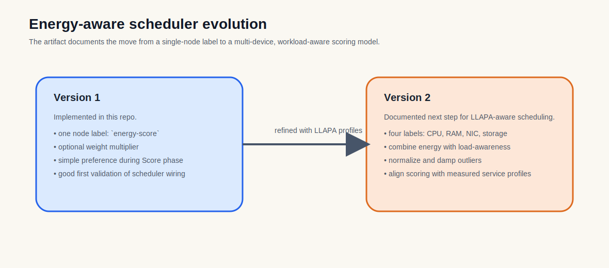

# EnergyScore Scheduler Artifact (v2)

This directory contains the scheduler-side artifact for LLAPA: a Kubernetes `ScorePlugin` called `EnergyScore`, the patch set required to register it in `scheduler-plugins`, and the configuration used to run it as `energy-scheduler`.



## What is implemented here

The code in [`pkg/energyscore/energyscore.go`](pkg/energyscore/energyscore.go) is the **v2** plugin implementation. It moves from a single energy label to a multi-component, service-aware scoring model.

### Key improvements over v1

| Aspect | v1 | v2 |
|--------|----|----|
| Node labels | One label: `energy-score` | Four labels: `energy-score-cpu`, `energy-score-ram`, `energy-score-nic`, `energy-score-sd` |
| Service awareness | None | Profiles for 7 TeaStore services (auth, db, image, persistence, recommender, registry, webui) |
| Load balancing | None | Dynamic load-threshold algorithm + pod-density awareness |
| Damping | Hard clamping | Soft `NormalizeScore` damping (keeps energy as a tie-breaker) |

## How v2 works

For every pod-to-node assignment, the plugin performs six steps:

1. **Cluster hot-load detection** — Finds the most-loaded node in the cluster (`clusterHotLoad`).
2. **Node load projection** — Computes current load + hypothetical pod load (`computeNodeLoad` + `podLoadDelta`).
3. **Service preference lookup** — Identifies the pod's service name from labels (`app`, `app.kubernetes.io/name`, etc.) and loads its normalized per-component energy profile.
4. **Node efficiency read** — Reads the four per-component energy labels from the node (neutral `50.0` if missing).
5. **Weighted energy score** — Multiplies node efficiency by the pod's component preferences, ranked by which hardware the service stresses most (CPU → RAM → SD → NIC). Primary component gets 50 % weight, down to 5 % for the least.
6. **Dynamic threshold scoring** — Iterates load thresholds `[0 %, 25 %, 50 %, 75 %, 100 %]`, skipping bands already exceeded by the hottest node. The first fitting threshold gives a **headroom score** (`100 - threshold`).

**Final raw score:**

```text
rawScore = 0.60 × thresholdHeadroom + 0.40 × weightedEnergy
```

If the node cannot fit into any threshold, it receives `0`.

### NormalizeScore (soft damping)

`NormalizeScore` rescales all node scores to `[0, 100]`, then dampens them toward the midpoint (`50`) by `effectiveDamping = 0.20 × weightMultiplier`.

With the default `weightMultiplier = 1.0`, the maximum spread between best and worst node is **~20 points**. This ensures `EnergyScore` acts as a **tie-breaker** and does not override `NodeResourcesFit` or `BalancedAllocation`.

### Load model

Node load is a combined ratio in `[0, 1]`:

```text
dominantRatio   = max(cpuRatio, memRatio)
podDensityRatio = podsOnNode / allocatablePods
combinedLoad    = 0.7 × dominantRatio + 0.3 × podDensityRatio
```

The same 70/30 split is used when projecting the additional load a pod would introduce.

## Node labels expected by v2

Each node must expose the following labels (values are energy-efficiency scores, typically `0–100`, where **higher is better / more efficient**):

- `energy-score-cpu`
- `energy-score-ram`
- `energy-score-nic`
- `energy-score-sd`

Missing or `0` labels are treated as neutral (`50.0`).

## Service profiles

`v2` ships with hard-coded normalized energy profiles for the TeaStore microservices. The profiles are derived from measured per-component Joule averages and min-max normalized per service so that each service's most demanding component scores `100` and its least demanding scores `0`.

| Service | Primary component | Secondary | Tertiary | Least |
|---------|-------------------|-----------|----------|-------|
| `webui` | CPU | RAM | SD | NIC |
| `image` | SD | CPU | RAM | NIC |
| `persistence` | CPU | RAM | SD | NIC |
| `auth` | CPU | RAM | SD | NIC |
| `db` | CPU | SD | RAM | NIC |
| `registry` | CPU | RAM | SD | NIC |
| `recommender` | CPU | RAM | SD | NIC |

Unknown services fall back to the default priority: **CPU → RAM → SD → NIC**.

## Files

- [`pkg/energyscore/energyscore.go`](pkg/energyscore/energyscore.go): `v2` plugin implementation.
- [`configs/energy-score-config.yaml`](configs/energy-score-config.yaml): scheduler config for `energy-scheduler`.
- [`configs/podep.yaml`](configs/podep.yaml): sample pod/deployment manifest.
- [`configs/test-pod.yaml`](configs/test-pod.yaml): simple test pod.
- `patches/*.patch`: changes required to register the plugin inside the upstream `scheduler-plugins` project.

## Build and run

1. Clone upstream `scheduler-plugins`.
2. Copy `pkg/energyscore`.
3. Apply the patches from this repo.
4. Copy the YAML config files.
5. Run `make build`.
6. Start the binary with `--config energy-score-config.yaml`.

Example:

```bash
git clone https://github.com/kubernetes-sigs/scheduler-plugins.git
cd scheduler-plugins
cp -r ../Research-Project-Energy-Consumption/scheduler-plugins/pkg/energyscore pkg/
git apply ../Research-Project-Energy-Consumption/scheduler-plugins/patches/*.patch
cp ../Research-Project-Energy-Consumption/scheduler-plugins/configs/*.yaml ./config/
make build
_bin/kube-scheduler --config ./config/energy-score-config.yaml --v=4
```

## How it connects to the paper

Section 5 of the paper introduced an energy-aware scheduler driven by LLAPA profiles. This directory is the implementation artifact for that line of work:

- `v1` mapped to the first pluginized scheduler integration (single global energy label).
- `v2` is the multi-component scoring model that matches the paper’s device-aware motivation: it reasons about **which hardware a microservice stresses** and **how efficient each node is for that specific hardware**.

## Present scope

The current code is fully functional for the TeaStore workload. To extend it to other applications:

1. Add new entries to `rawServiceEnergy` and `servicePriority` with measured per-component Joule averages.
2. Or generalize the profile source to read from a ConfigMap or external API instead of hard-coded maps.
